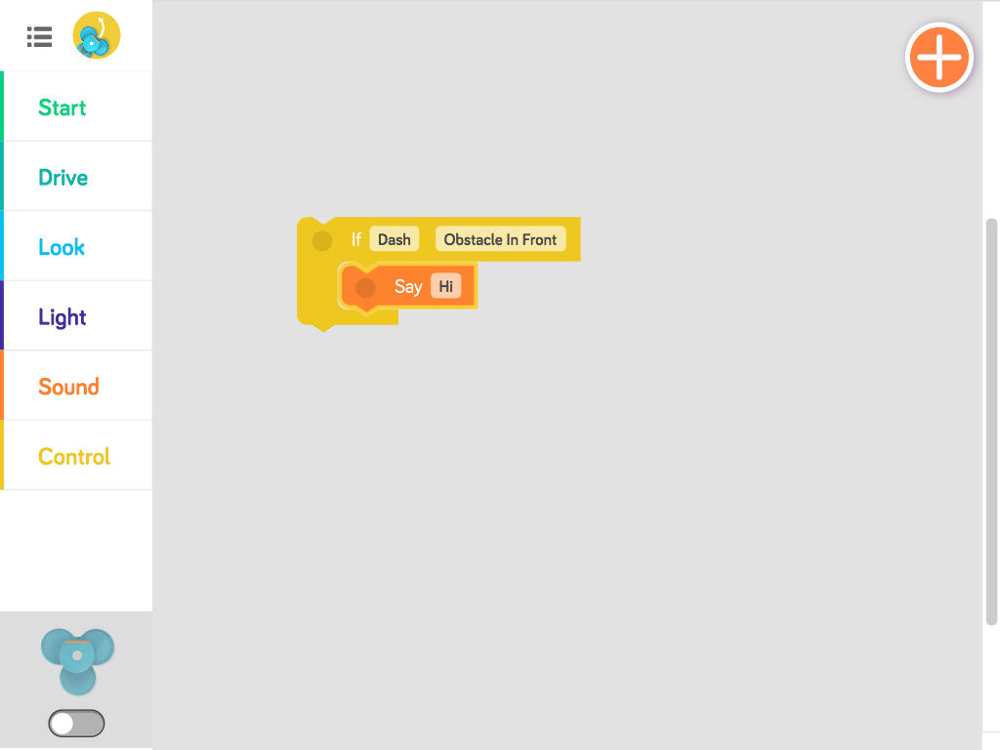
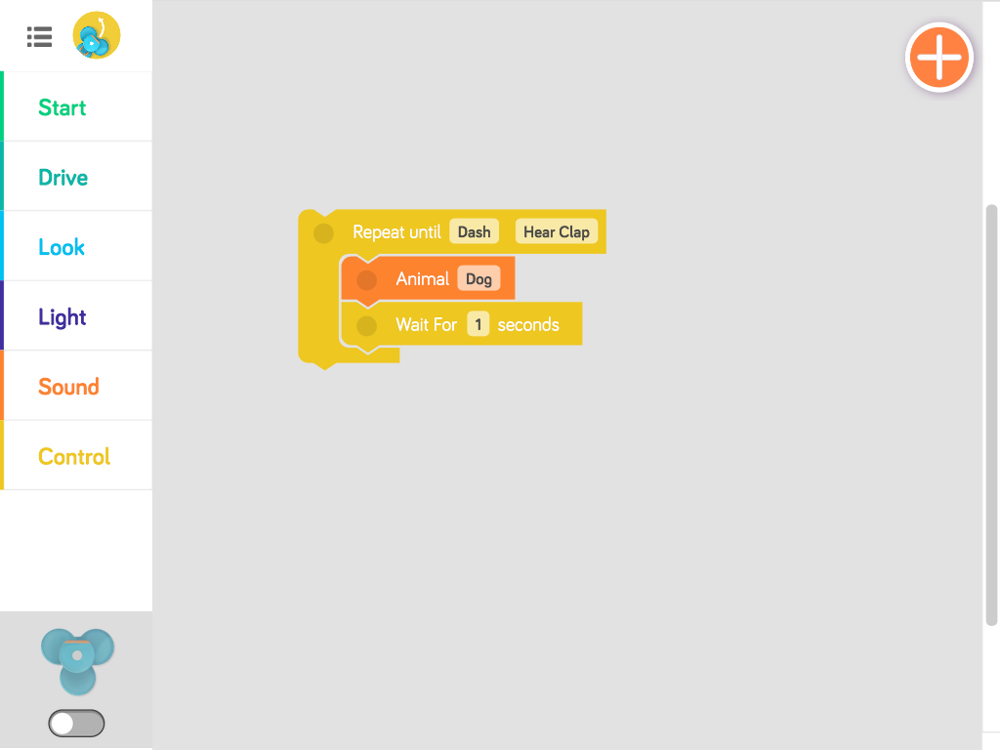

<!------------------------------------------------------------>
<!-- Topic: xxx -->

<h1>Computer Science</h1>

    <small>Aaron Racicot - <a href="mailto:aaronr@z-pulley.com">aaronr@z-pulley.com</a>
 
<a href="http://reprojected.com">reprojected.com</a> / <a href="http://twitter.com/reprojected">@reprojected</a> / <a href="https://github.com/aaronr">github.com/aaronr</a></small>

<!------------------------------------------------------------>
--SLIDE--
<!-- Topic: Introduce myself -->

<h1>Who I am?</h1>

<ul>
  <li class="fragment"><strong>SW Developer</strong></li>
  <li class="fragment"><strong>Environmental Scientist</strong></li>
  <li class="fragment"><strong>Open Source Advocate</strong></li>
</ul>

--SUBSLIDE--

  <h3>Computer Science (UW)</h3>
  <h2>Bridging the Gap</h2>
  <h3>Environmental Science (OHSU)</h3>

--SUBSLIDE--

  <h3>Work for NOAA</h3>
  
  <h3>Environmental Response</h3>

<!------------------------------------------------------------>
--SLIDE--
<!-- Topic: Computers Science -->

<h1>Computer <b>Science</b></h1>
<h3>Like looking under the hood of a car...</h3>

<h3>Looking behind a website...</h3>
<h3>Looking inside of a device...</h3>

--SUBSLIDE--

<h2><b>Coding</b> can be a fun</h2>

--SUBSLIDE--

<h2><b>Coding</b> can be a job</h2>

<h2><b>Many</b> types</h2>

<h2>of <b>computers</b></h2>

--SUBSLIDE--

<h2>Computers are</h2>

<h2><b>everywhere</b></h2>

<!------------------------------------------------------------>
--SLIDE--
<!-- Topic: Computers Science -->

<h1>Computer <b>Science</b></h1>
<h2>"Computer science is the scientific and practical approach to computation and its applications."</h2>

--SUBSLIDE--

<h2>"Its fields can be divided into a variety of theoretical and practical disciplines."</h2>

<!------------------------------------------------------------>
--SLIDE--
<!-- Topic: Computers Science -->

<h1>Theoretical </h1>
<h2>How do you sort a list of numbers... fast...<h2>

--SUBSLIDE--

<h1>Computer Science - Practical </h1>
<h2>How do you make a website (writing html, javascript and web services)</h2>
<h2>How do you write a program to drive a car (google self driving cars)</h2>
<h2>How do you cast a shadow when creating animation (ray tracing)</h2>

<!------------------------------------------------------------>
--SLIDE--
<!-- Topic: Computers Science -->

<h1>But why?</h1>
<h2>The end goal is to map some other domain problem to computer science to solve problems</h2>

--SUBSLIDE--

<h1>It will change your life!</h1>

<!------------------------------------------------------------>
--SLIDE--
<!-- Topic: Computers Science -->

<h1>Starting at the bottom</h1>
<ul>
  <li class="fragment"><strong>Computers crunch numbers... its all math</strong></li>
  <li class="fragment"><strong>The brains are the CPU</strong></li>
  <li class="fragment"><strong>Short term memory is the RAM</strong></li>
  <li class="fragment"><strong>Long term memeory is the Harddrive</strong></li>
  <li class="fragment"><strong>The language the brain (CPU) speaks is "code"</strong></li>
  <li class="fragment"><strong>Analog/Digital</strong></li>
</ul>

--SUBSLIDE--

<h1>Finishing at the top</h1>
<ul>
  <li class="fragment"><strong>Systems interact with humans (or other systems)</strong></li>
</ul>

<!------------------------------------------------------------>
--SLIDE--
<!-- Topic: Languages -->

<h2><b>Language</b></h2>

<h2>is important</h2>

--SUBSLIDE--

<h2>Computers speak</h2>

<h2><b>many</b> languages</h2>

--SUBSLIDE--

<h1>... called <b>Code</b></h1>

--SUBSLIDE--

<h2>Not all <b>code</b></h2>

<h2>looks <b>scary</b></h2>

<!------------------------------------------------------------>
--SLIDE--
<!-- Topic: Languages -->

<h2><b>Languages</b> (code)</h2>
<ul>
  <li class="fragment"><strong>Low level languages (Assembly Language)</strong></li>
  <li class="fragment"><strong>High-level languages (C, C++, Java, Python, Javascript, etc)</strong></li>
  <li class="fragment"><strong>Code is really just the syntax (i.e. like english, french, spanish)</strong></li>
  <li class="fragment"><strong>Logic is the common element (i.e. you can say "Car" in many languages...) </strong></li>
</ul>

--SUBSLIDE--

<!------------------------------------------------------------>
--SLIDE--
<!-- Topic: Code -->

<h2><b>Code</b> constructs</h2>

--SUBSLIDE--

<h2><b>Input</b> and <b>Output</b></h2>

--SUBSLIDE--

--SUBSLIDE--

--SUBSLIDE--

<h2><b>If</b></h2>

--SUBSLIDE--

--SUBSLIDE--

--SUBSLIDE--

<h2><b>Loops</b></h2>

--SUBSLIDE--

--SUBSLIDE--

<!------------------------------------------------------------>
--SLIDE--
<!-- Topic: Logic -->

<h2><b>Critical Thinking</b></h2>

--SUBSLIDE--

<h2><b>Mathmatical Logic</b></h2>

--SUBSLIDE--

<h2><b>Logic</b></h2>

--SUBSLIDE--

<!------------------------------------------------------------>
--SLIDE--
<!-- Topic: Example -->

