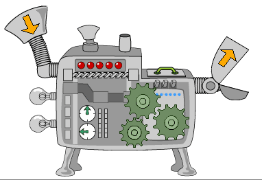
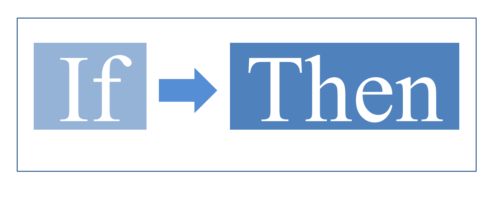

<!------------------------------------------------------------>
<!-- Topic: xxx -->

<h2>Computer Science</h2>

    <small>Aaron Racicot - <a href="mailto:aaronr@z-pulley.com">aaronr@z-pulley.com</a>
 
<a href="http://reprojected.com">reprojected.com</a> / <a href="http://twitter.com/reprojected">@reprojected</a> / <a href="https://github.com/aaronr">github.com/aaronr</a></small>

<!------------------------------------------------------------>
--SLIDE--
<!-- Topic: Introduce myself -->

<h1>Who I am?</h1>

<ul>
  <li class="fragment"><strong>SW Developer</strong></li>
  <li class="fragment"><strong>Environmental Scientist</strong></li>
  <li class="fragment"><strong>Open Source Advocate</strong></li>
</ul>

--SUBSLIDE--

  <h3>Computer Science (UW)</h3>
  <h2>Bridging the Gap</h2>
  <h3>Environmental Science (OHSU)</h3>

--SUBSLIDE--

  <h3>Work for NOAA</h3>
  
  <h3>Environmental Response</h3>

<!------------------------------------------------------------>
--SLIDE--
<!-- Topic: Computers Science -->

<h2>Computer <b>Science</b></h2>
<h4>Like looking under the hood of a car...</h4>
 

 
<h3>Looking behind a website...</h3>
<h3>Looking inside of a device...</h3>

--SUBSLIDE--

<h2><b>Coding</b> can be a fun</h2>

--SUBSLIDE--

<h2><b>Coding</b> can be a job</h2>

--SUBSLIDE--

<h2><b>Many</b> types</h2>

<h2>of <b>computers</b></h2>

--SUBSLIDE--

<h2>Computers are</h2>

<h2><b>everywhere</b></h2>

<!------------------------------------------------------------>
--SLIDE--
<!-- Topic: Computers Science -->

<h3>"Computer science is the</h3>
<h3>scientific and practical</h3>
<h3>approach to computation</h3> 
<h3>and its applications."</h3>

--SUBSLIDE--

<h3>"Its fields can be divided</h3>
<h3>into a variety of theoretical</h3>
<h3>and practical disciplines."</h3>

<!------------------------------------------------------------>
--SLIDE--
<!-- Topic: Computers Science -->

<h2>Theoretical </h2>
<h3>How do you sort numbers?<h3>

--SUBSLIDE--

<h2>Practical </h2>
<ul>
  <li><strong>How do you make a website (writing html, javascript and web services)</strong></li>
  <li class="fragment"><strong>How do you write a program to drive a car (Google self driving cars)</strong></li>
  <li class="fragment"><strong>How do you cast a shadow when creating animation (Ray Tracing)</strong></li>
</ul>

<!------------------------------------------------------------>
--SLIDE--
<!-- Topic: Computers Science -->

<h2>But why?</h2>

<h3>End goal is to <b>map</b> some domain</h3>
<h3><b>problem</b> to computer science</h3>
<h3>to help <b>solve</b> that problem</h3>

--SUBSLIDE--

<h2>It will change your life!</h2>

<!------------------------------------------------------------>
--SLIDE--
<!-- Topic: Computers Science -->

<h2>Starting at the bottom</h2>
<ul>
  <li><strong>Computers crunch numbers... its all math</strong></li>
  <li class="fragment"><strong>The brains are the CPU</strong></li>
  <li class="fragment"><strong>Short term memory is the RAM</strong></li>
  <li class="fragment"><strong>Long term memory is the Hard drive</strong></li>
  <li class="fragment"><strong>The language the brain (CPU) speaks is "code"</strong></li>
  <li class="fragment"><strong>Analog <-> Digital</strong></li>
</ul>

--SUBSLIDE--

<h2>Finishing at the top</h2>
<ul>
  <li><strong>Systems</strong> interact with humans (or other systems)</li>
  <li class="fragment"><strong>Interfaces</strong> are constantly changing</li>
  <li class="fragment"><strong>Asynchronous</strong> vs <strong>Synchronous</strong></li>
</ul>

<!------------------------------------------------------------>
--SLIDE--
<!-- Topic: Languages -->

<h2><b>Language</b></h2>

<h2>is important</h2>

--SUBSLIDE--

<h2>Computers speak</h2>

<h2><b>many</b> languages</h2>

--SUBSLIDE--

<h2>... called <b>Code</b></h2>

--SUBSLIDE--

<h2>Not all <b>code</b></h2>

<h2>looks <b>scary</b></h2>

<!------------------------------------------------------------>
--SLIDE--
<!-- Topic: Languages -->

<h2><b>Languages</b> (code)</h2>
<ul>
  <li><strong>Low level languages (Assembly Language)</strong></li>
  <li class="fragment"><strong>High-level languages (C, C++, Java, Python, Javascript)</strong></li>
  <li class="fragment"><strong>Code is just the syntax (English, French, Spanish)</strong></li>
  <li class="fragment"><strong>Logic is the common element (i.e. you can say "Car" in many languages) </strong></li>
</ul>

<!------------------------------------------------------------>
--SLIDE--
<!-- Topic: Code -->

<h2><b>Code</b> constructs</h2>

--SUBSLIDE--

<h2>Variables</h2>

--SUBSLIDE--

<pre><code>
>>> x = 1
>>> x
1
>>> y = 2
>>> y
2
>>> x + y
3
>>> x = 10
>>> x + y
12
</code></pre>

--SUBSLIDE--

<h2><b>Input</b> and <b>Output</b></h2>

--SUBSLIDE--

--SUBSLIDE--

<pre><code>
z-air: aaronr$ python
Python 2.7.10 (default, Oct 23 2015, 18:05:06)
[GCC 4.2.1 Compatible Apple LLVM 7.0.0 (clang-700.0.59.5)] on darwin
Type "help", "copyright", "credits" or "license" for more information.

>>> name = raw_input("Enter your name: ")
Enter your name: Aaron
>>> name
'Aaron'
</code></pre>

--SUBSLIDE--

<h2><b>If/Then/Else</b></h2>

--SUBSLIDE--

--SUBSLIDE--

<pre><code>
>>> name == 'Aaron'
True

>>> if name == 'Aaron':
...     print "Hi there Aaron"

Hi there Aaron
</code></pre>

--SUBSLIDE--

<h2>Boolean Logic</h2>
<pre><code>
>>> True == 1
True
>>> False == 0
True
>>> True and False
False
>>> True and True
True
>>> True or False
True
>>> False or False
False
>>> not True
False
</code></pre>

--SUBSLIDE--

<h2><b>Loops</b></h2>

--SUBSLIDE--

--SUBSLIDE--

<pre><code>
>>> for x in xrange(10):
...        print "x = %d" % x
x = 0
x = 1
x = 2
x = 3
x = 4
x = 5
x = 6
x = 7
x = 8
x = 9
</code></pre>

--SUBSLIDE--

<pre><code>
>>> x = 10
>>> while x > 0:
...     print "x = %d" % x
...     x = x - 1
...
x = 10
x = 9
x = 8
x = 7
x = 6
x = 5
x = 4
x = 3
x = 2
x = 1
</code></pre>

--SUBSLIDE--

--SUBSLIDE--

<pre><code>
import numpy as np
import matplotlib.pyplot as plt

mu, sigma = 100, 15
x = mu + sigma * np.random.randn(10000)

# the histogram of the data
n, bins, patches = plt.hist(x, 50, normed=1, facecolor='g', alpha=0.75)

plt.xlabel('Smarts')
plt.ylabel('Probability')
plt.title('Histogram of IQ')
plt.text(60, .025, r'$\mu=100,\ \sigma=15$')
plt.axis([40, 160, 0, 0.03])
plt.grid(True)
plt.show()
</code></pre>

<!------------------------------------------------------------>
--SLIDE--
<!-- Topic: Logic -->

<h2><b>Critical Thinking</b></h2>

--SUBSLIDE--

<h2><b>Mathematical Logic</b></h2>

--SUBSLIDE--

<h2><b>Logic</b></h2>

--SUBSLIDE--

<!------------------------------------------------------------>
--SLIDE--
<!-- Topic: Example -->

<!------------------------------------------------------------>
--SLIDE--
<!-- Topic: Example -->

<!------------------------------------------------------------>
--SLIDE--
<!-- Topic: Example -->

<h2><b>HTML</b></h2>
<h3>Hyper Text Markup Language</h3>

<pre><code>
    

      <h1 id="score">Score = 0</h1>
    

</code></pre>

--SUBSLIDE--

<h2><b>Head</b></h2>
<pre><code>
&lt;head&gt;
  &lt;title&gt;Aaron's Pong Game&lt;/title&gt;
  &lt;link rel=&quot;stylesheet&quot; href=&quot;https://maxcdn.bootstrapcdn.com/bootstrap/3.3.2/css/bootstrap.min.css&quot;&gt;
  &lt;style&gt;
    .scoreboard {
      background-color: #2ba6cb;
    }
  &lt;/style&gt;
&lt;/head&gt;
</code></pre>

--SUBSLIDE--

<h2><b>Body</b></h2>
<pre><code>
&lt;body&gt;
  &lt;div class=&quot;container&quot;&gt;
    &lt;div class=&quot;col-md-4 scoreboard&quot;&gt;
      &lt;h1 id=&quot;score&quot;&gt;Score = 0&lt;/h1&gt;
    &lt;/div&gt;
    &lt;div class=&quot;col-md-8 gameboard&quot;&gt;
      &lt;center&gt;
        &lt;h1 class=&quot;cover-heading&quot;&gt;My Pong Game&lt;/h1&gt;
        &lt;canvas id=&quot;pong&quot; data-processing-sources=&quot;pong.pde&quot;/&gt;&lt;/canvas&gt;
      &lt;/center&gt;
    &lt;/div&gt;
  &lt;/div&gt;
  &lt;script src=&quot;https://cdnjs.cloudflare.com/ajax/libs/processing.js/1.4.16/processing.js&quot;&gt;&lt;/script&gt;
&lt;/body&gt;
</code></pre>

<!------------------------------------------------------------>
--SLIDE--
<!-- Topic: Example -->

<h2><b>CSS</b></h2>
<h3>Cascading Style Sheets</h3>

--SUBSLIDE--

<h2><b>By Class</b></h2>
<pre><code>
  &lt;style&gt;
    .scoreboard {
      background-color: #2ba6cb;
    }
  &lt;/style&gt;
</code></pre>

--SUBSLIDE--

<h2><b>By ID</b></h2>
<pre><code>
  &lt;style&gt;
    #scoreboard {
      background-color: #2ba6cb;
    }
  &lt;/style&gt;
</code></pre>

--SUBSLIDE--

<h3>The difference between an ID and</h3>
<h3>a class is that an ID can be used</h3>
<h3>to identify one element, whereas</h3> 
<h3>a class can be used to identify</h3>
<h3>more than one.</h3>

<!------------------------------------------------------------>
--SLIDE--
<!-- Topic: Example -->

<h2><b>JavaScript</b></h2>
<h3>high-level, dynamic, untyped, and</h3>
<h3>interpreted programming </h3>
<h3>language</h3>

--SUBSLIDE--

<pre><code>
$(document).ready(function() {

    var map = L.map('map', {maxZoom: 22}).setView([48.03, -122.4085], 14);

    var featureLayer = L.mapbox.featureLayer()
        .loadURL('/gisdata/geojson/citylimitsline_4326.geojson')
        .addTo(map);
});
</code></pre>

<!------------------------------------------------------------>
--SLIDE--
<!-- Topic: Example -->

